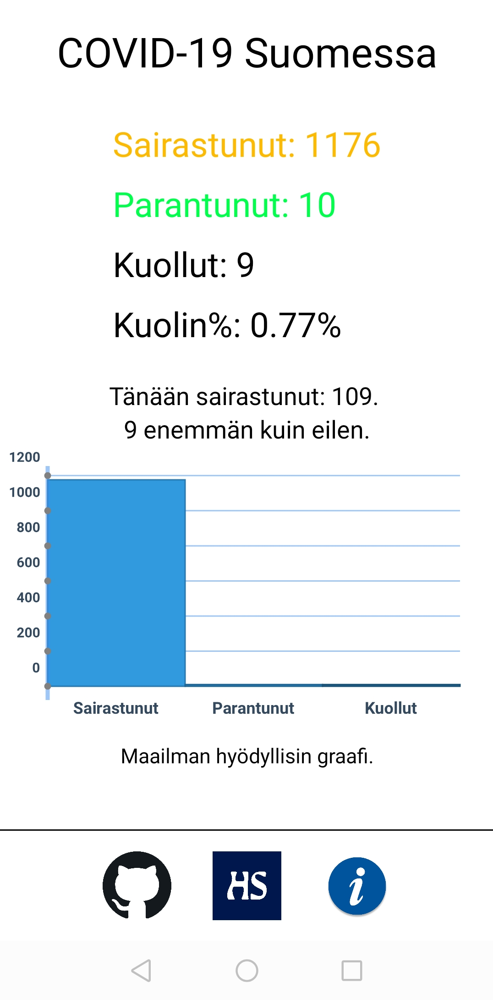

# covid19_visualisointi

Projektin tarkoituksena oli visualisoida Suomen koronatilannetta käyttäen React Native expoa ja [HS:n rajapintaa](https://github.com/HS-Datadesk/koronavirus-avoindata).

## Sovelluksen toiminta ja käytetyt resurssit

Ohjelma hakee em. rajapinnasta sairastuneiden, parantuneiden ja kuolleiden määrän tarkastelemalla niille tarkoitettujen listojen viimeistä objektia.
Haetusta datasta lasketaan kuolinprosentti ja se näyttään tekstimuodossa muiden tietojen kanssa. Parantuneiden määrä ei vastaa oikeita lukuja, sillä sen tiedon saaminen on hankalaa eikä sitä päivitetä rajapintaan. Yksi keino olisi ollut laskea yli kaksi (2) viikkoa sairastaneet parantuneiden joukkoon, mutta tämä ei olisi mielestäni ollut "luotettavaa". Ohjelma laskee myös nykyisen päivän sairastuneet ja menneen päivän sairastuneet, jonka jälkeen se kertoo tilanteen muutoksen suhteessa nykyiseen päivään.

Pylväskaavio näyttää haetut tiedot sellaisenaan ja sen teossa on käytetty [react-native-pathjs](https://github.com/capitalone/react-native-pathjs-charts) -kirjastoa.
Kyseinen kirjasto ei ole paras mahdollinen ja sen asennuksen kanssa voi olla joitain ongelmia.
Pyrkisin olla käyttämättä ulkoisia resursseja, jollei ollut pakko. Käyttöliittymä on onneksi yksinkertainen, joten sen tekoon en ottanut kirjastoa.

## Testaus

Testauksessa käytettiin vain android puhelimia - OnePlus 7t ja Honor 10 - expon oman applikaation kautta.
Vaikka kehitysympäristön pitäisikin olla suhkoot joustava käyttöalustojen kanssa, niin eri puhelinmalleilla ja käyttöjärjestelmillä voi ilmetä ongelmia.

## Ulkoasu

